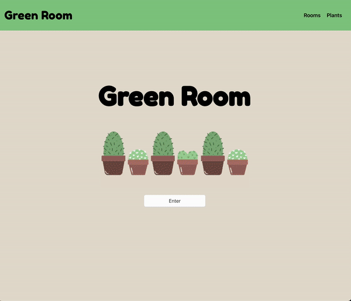
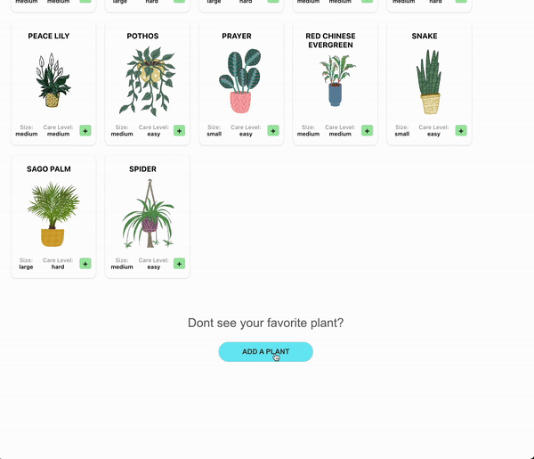

# Green Room
Team Members: Chris Ou, Jordan Jennings, and Eric Jubera
</br>
Phase 3: Ruby
</br>
</br>


## Overview
Green Room is an interactive plant expirience that allows users to search for plants, add plants to their rooms, and keep track of their watering schedule. The motivation behind this project was to create a fun visual of how many to many relationships work!
</br>
</br>


## What It Does
The frontend of this project is built with React. Plants can be searched by name and filtered by difficulty of care. Plants can be added to room of choice. On the bottom of the Plant page, a new plant can be added and saved to the database. Within the Rooms page, a user can keep track of when their plants were last watered and choose to water their plants. Users also have the options to add new rooms, delete rooms, and delete plants inside of rooms.
</br>
</br>


</br>
</br>

## How It Functions
The main functionality is built using fetch requests to handle all CRUD capabilities. The three tables being interacted with by the frontend are Rooms, Plants, and Added_Plants. The database and routes are being handle by Active Records and Sinatra. 
</br>
</br>

## How to Run the Project
The app requires you to install dependencies and run a local server. Read directions on how to get the backend started at: https://github.com/jordanje/green-room-backend. Fork and download both repositories to your computer to get the site fully functioning.

```
$ npm install 
$ npm start
```

</br>
