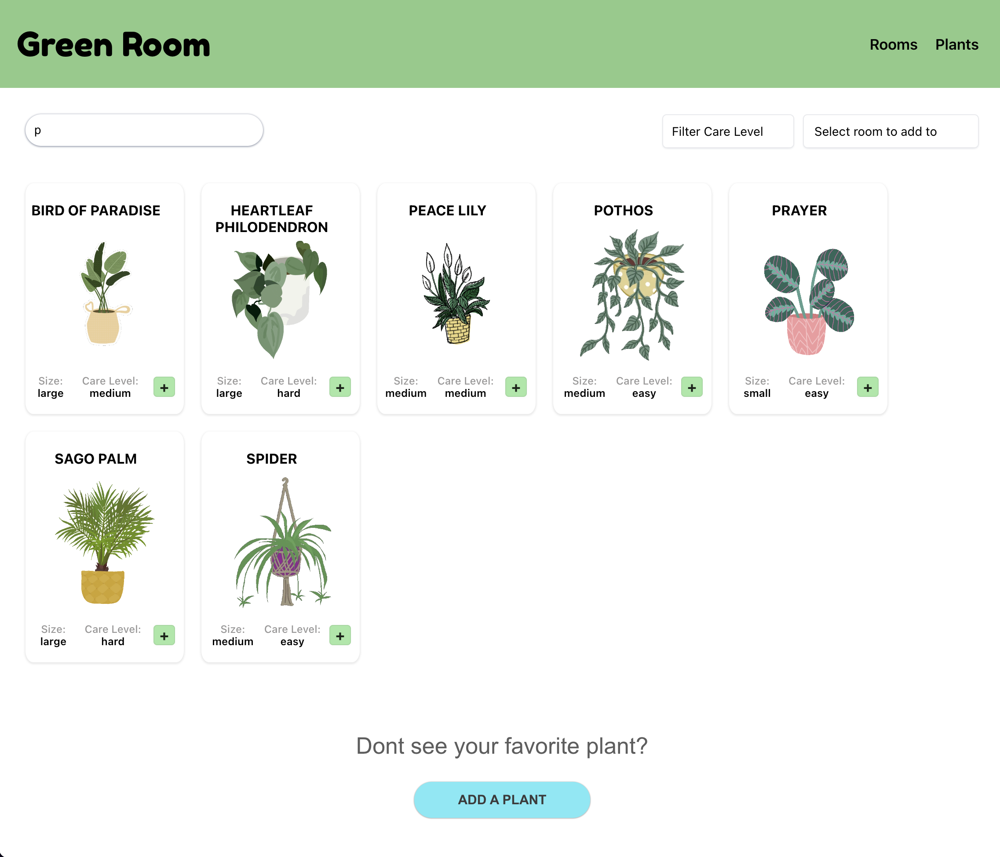

# All Bike Trails
Team Members: Ben Kurose, Jordan Jennings, Joanna Bell
</br>
Phase 2: React
</br>
</br>


## Overview
The All Bike Trails app allows users to search for bike trails by location and add their favorite trails to share with other trail riders. The motivation behind creating this app was to provide users, specifically bikers, a seamless way to find and share places to ride. Thus, reducing the time and stress involved between getting out the door and getting on their bike. It also creates a sense of community and information exchange for users who otherwise may not have met.
</br>
</br>


## How It Works
The app is built with React and Bootstrap. All Bike Trails has a search functionality on the homepage that filters bike trails to the users preference based on location and name. Users can also add bike trails allowing them to share their favorites and comments with other users. Trails can be deleted later if the user prefers.
</br>
</br>


</br>
</br>


## How It Functions
The main functionality is built using a fetch request to handle CRUD capabilities: create new trails, read trails from database, update comments for a trail and delete a trail. We're replicating a backend server by using json-server. The new trails are saved in the db.json file. Trails can be deleted as well by using a DELETE request and removing it from db.json.
</br>
</br>

## How to Run the Project
The app requires you to install dependencies and run a local server. Ideally in the future it will be hosted by an external server. To test All Bike Trails for yourself, clone this repository to your local computer. 

```
$ npm install -g json-server
$ cd all-bike-trails
$ json-server --watch db.json
```

</br>
